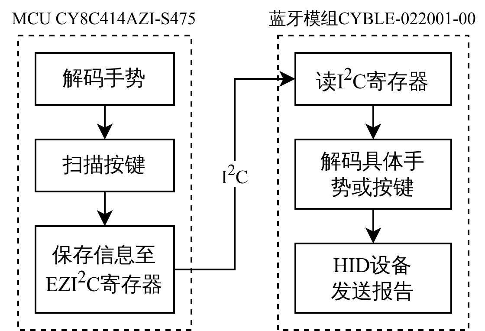

# CY8CKIT-149 BLE HID Keyboard & CapSense Touch Buttons and Slider

基于英飞凌 CY8CKIT-149 开发板，通过 BLE HID 实现了一个蓝牙键盘设备，可通过蓝牙与 PC 连接，通过板载的触摸按键与滑条实现对 PC 音量、屏幕亮度、翻页控制：触摸按键 BTN0/1 控制亮度+/-、BTN2 音量+；触摸滑条左/右滑动控制上/下翻页。

## 📦 Prerequisites

由于需要为 MCU 与 蓝牙模组两个模块编程，而板卡的蓝牙模块较老，无法用 [ModusToolbox](https://softwaretools.infineon.com/tools/com.ifx.tb.tool.mtbeclipse) 开发，因此使用 [PSoC Creator](https://softwaretools.infineon.com/tools/com.ifx.tb.tool.psoccreator)。

本仓库库仅提供了业务端部分的代码，未提供库。需要导入工程后重新生成项目并编译。

## 📜 Documentation

### ⛓️ Workflow

    

### 📽️ More details

1. 项目详细说明，[CSDN：基于CY8CKIT-149 BLE HID设备实现及PC控制功能开发(BLE HID+CapSense)](https://blog.csdn.net/weixin_46422143/article/details/145437772)
2. 项目功能演示，[B站：基于CY8CKIT-149 BLE HID设备实现及PC控制功能开发](https://www.bilibili.com/video/BV1WTNPepEjx/)
